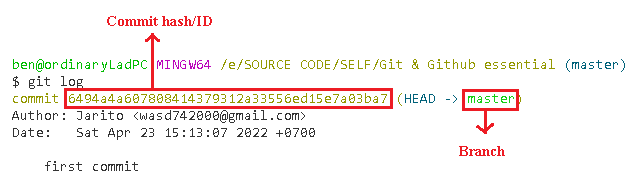
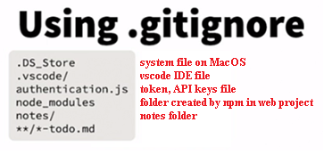
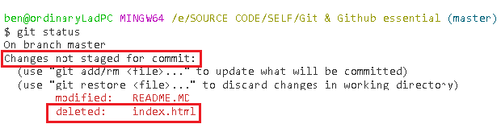
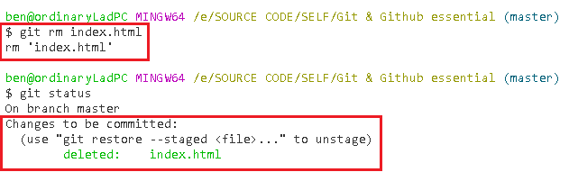
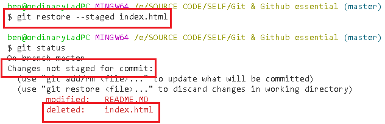
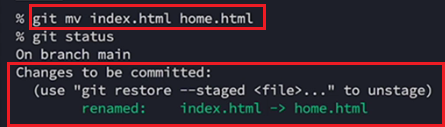
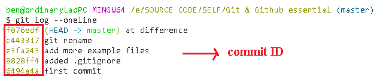
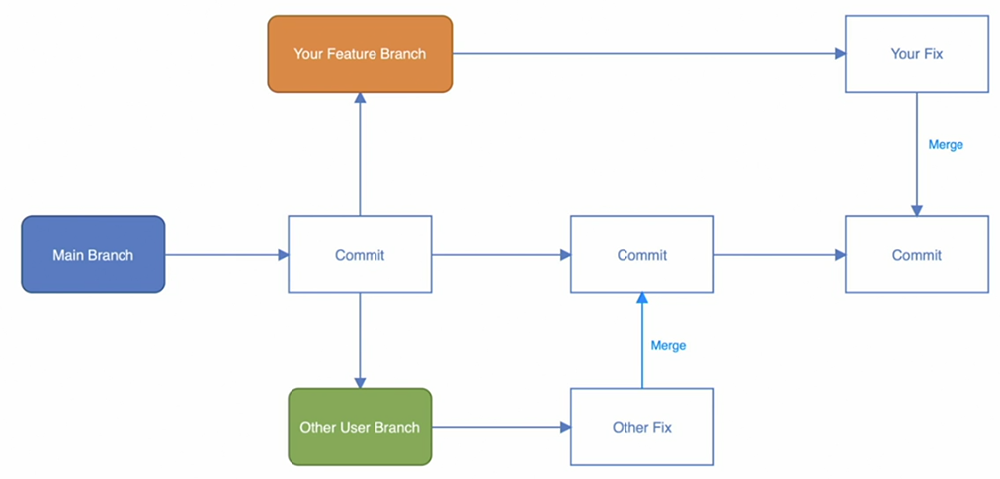
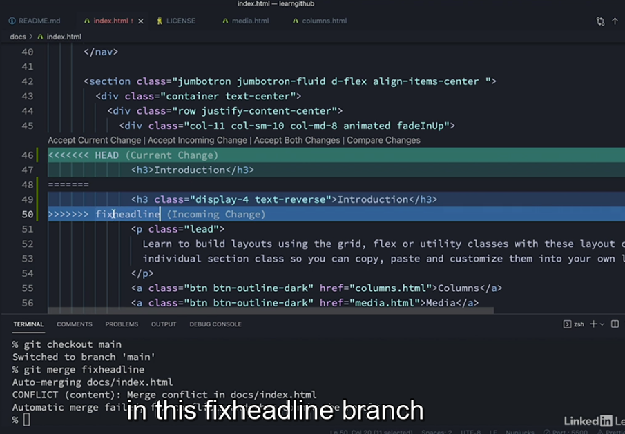

**GIT & GITHUN ESSENTIAL TRAINING**

# GIT
## 1) Git config
In gitbash (or other terminal)
```
git config --global user.name "<name here>"
git config --global user.email "<email here>" 
```
- Tell git who you are so that it will give you credit for the changes you made.
- Option `--global`  meaning that all the project on the computer use the same name and email.
- Use the same email registed with github.

Prepare the project folder. In the project folder:
```
git init
// this will create .git folder
```
## 2) Staging files
- Staging area: a temporary area to store files that we want to commit later on.
- To add files to staging area:
``` 
git add <FILENAME> 

# or add all files
git add --all
git add -A
git add .
```
- Commit (make a checkpoint for the project)
```
git commit -m "<commit note here>"
```
- Use `git log` to display all of the commits in a repository's history
```
# often open log file in less editor
git log
```

## 3) Git environment
Git has 3 environment to move files:
- Working
- Staging
- Commit

Before a commit, files can be in 2 states:
- Tracked: files existed in the previous snapshot (commit)
- Untracked: anything else (new files added since the last commit)

Tracked files can be in several states:
- Unmodified: files have not changed since the last commit
- Modified: files have changed since the last commit
- Staged: files moved to staging environment

To view git environment changes:
```
git status
```

Restore (to unstage):
```
git restore FILENAME
# restore whole folder
git restore .
# or
git checkout .
```
## 4) Ignore files
Why ?
- Sensitive files
- Personal notes
- System files

Create a `.gitignore` file at the root of the project. 
<br>

Global ignore file:
```
git config --global core.excludesfile [ignored file go here]
```

You may add a file to .gitignore file after a lot of commits. Should clear local caches:
```
git rm -r --cached .
```

## 5) Deleting and renaming files
### a) Deleting files
- Deleting project files using system file management or IDE file management can be restore by using `git restore`.
<br>
- Deleting project files using `git rm NAMEFILE` not only delete the file, but also move that deletion into staging and ready for commit (`git add`).
<br>
- Using `git restore --staged FILENAME` to unstage.
<br>

### b) Renaming files
- You can rename project files using system file management or IDE file management. This will copy the file with new name and delete the old name file. You can undo this by using `git restore` and delete the new name file.
<br>
- Rename using git:
```
git mv <oldFileName> <newFileName>
```
- The file is also ready to be commited
<br>

## 6) Differences
- To check the difference of all project files compare to the last commit, using: 
```
git diff
```
- VS code has *Source control* with the same usage.
- Using `git log --oneline` for brief log information.
<br>
- Using `git diff` to show differences between two commit.
```
git diff <commitID1> <commitID2>
```

## 7) Changing history
### a) Amending
- Add thing to the last commit (without creating a new commit).
```
git commit -amend

# or with new message for the last commit
git commit -am '<new commit message>'

# or leave the message the same like the last commit
git commit -amend --no-edit
```
- Use `git reset` to go back to previous commit (to the commit ID). But the files of the current commit remain unchanged (`git status` shows modified).
```
git reset <commitID>
```
- Add `--hard` option to `git reset` to go back to previous commit and remove all changes (NOTICE: unsafe).
```
git reset --hard <commitID>
```

### b) Rebasing ?
- Rewrite history and reorganize the order of commits (with editor).
```
git rebase <branch>/<commit>
# git rebase --interactive <branch>/<commit>

# rebase by moing back to the last n commits.
git rebase -i HEAD~<n commits>

# all commits ?
git rebase -i --root
```

## 8) Branches
- Branches let you create different versions of your code (experiment new code, ...).
- Show branches:
```
git branch
# * main
```
- Make a new branch with the copy of an existing branch (new branch will have same history of original branch), or switch to a different existing branch
```
git switch -c <new branch name>

# or
git checkout -b <new branch name>
```
- Use `git merge`to synchronize a new branch to the main branch.
```
# you should switch back to main branch
#  before merging
git switch main

# sync current branch to main branch
git merge <current branch>
```
- Deleting a branch when it's no longer needed.
```
git branch --delete <branch name>

# or 
git branch -d <branch name>
git branch -D <branch name>
```
- The sequence of doing things above called *git flow*:
    1. Create a new branch (feature/fix branch)
    2. Make changes
    3. Merge to master/main
    4. Delete old branch

## 9) Merge conflict ?
- Two branch edits the same file and merge to the main branch may cause merge conflict.
<br>
- For example below, the main branch and the 'fixheadline' branch are not sync in the introduction's class. When merging fixheadline branch to the main branch, the merge coflict prompt (vs code).
<br>

-Removing

## 10) Stash & Clean
- `Git stash` stores the code changes temporarily to the stash and go back to last commit state.
```
# store all the changes temporarily in a stash
git stash

# check what's been stored
git stash list

# apply changes in stash number n
git stash apply <n>

# remove top of the stash and apply it
# you may use git restore . to resote back to the last commit state
git stash pop
```


# GITHUB